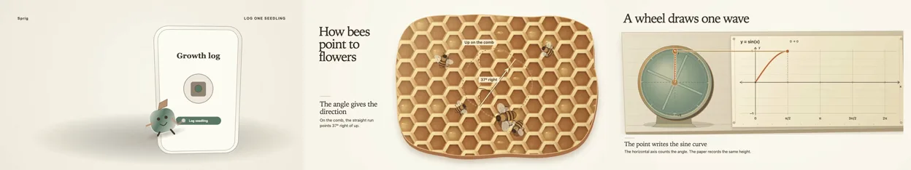
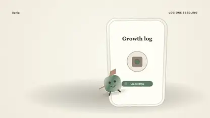
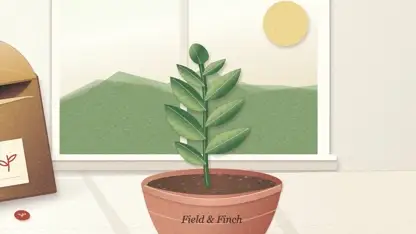
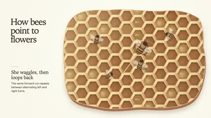
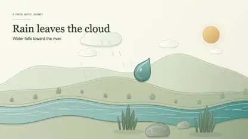
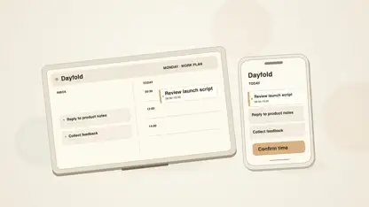

# Awesome Fable 5.2 Videos

A gallery for making story-led product videos and animated explainers with **Claude Fable 5.2**. Browse the previews, then grab a free Skill to try with your own material.

[Browse Launchry](https://launchry.dev/skills) · [Browse Loretry](https://loretry.dev/skills)

The featured films are examples from Launchry and Loretry. Community submissions include the creator’s evidence of the model used.

## Contents

- [Product launch videos](#product-launch-videos)
- [Animated explainers](#animated-explainers)
- [Free Skills](#free-skills)
- [Submit a video](#submit-a-video)

## Product launch videos

<table>
  <tr>
    <td width="33%" valign="top">
       
      <a href="https://launchry.dev/skills/launchry-l05-mascot-led-phone-launch"><strong>Mascot-led Phone Launch</strong></a> 
      Launchry · Paid 
      Let an original character carry one useful action into a phone. 
      <a href="https://launchry.dev/skills/launchry-l05-mascot-led-phone-launch">Watch preview on Launchry</a>
    </td>
    <td width="33%" valign="top">
       
      <a href="https://launchry.dev/skills/launchry-cut-paper-product-story"><strong>Cut Paper Product Story</strong></a> 
      Launchry · Paid 
      Open a seed packet and follow it to a blooming windowsill. 
      <a href="https://launchry.dev/skills/launchry-cut-paper-product-story">Watch preview on Launchry</a>
    </td>
    <td width="33%" valign="top">
       
      <a href="https://launchry.dev/skills/launchry-l20-steam-led-product-film"><strong>Steam-led Product Film</strong></a> 
      Launchry · Paid 
      Follow rising vapor into a physical product launch. 
      <a href="https://launchry.dev/skills/launchry-l20-steam-led-product-film">Watch preview on Launchry</a>
    </td>
  </tr>
</table>

## Animated explainers

<table>
  <tr>
    <td width="33%" valign="top">
       
      <a href="https://loretry.dev/skills/loretry-r68-how-bees-give-directions"><strong>How Bees Give Directions</strong></a> 
      Loretry · Paid 
      Follow the same bearing from a waggle on the comb to a flight toward flowers. 
      <a href="https://loretry.dev/skills/loretry-r68-how-bees-give-directions">Watch preview on Loretry</a>
    </td>
    <td width="33%" valign="top">
       
      <a href="https://loretry.dev/skills/loretry-vibe-coastal-map-story"><strong>Coastal Map Story</strong></a> 
      Loretry · Paid 
      Follow one fog bank from cold water to the low ground inland. 
      <a href="https://loretry.dev/skills/loretry-vibe-coastal-map-story">Watch preview on Loretry</a>
    </td>
    <td width="33%" valign="top">
       
      <a href="https://loretry.dev/skills/loretry-vibe-cutout-object-motion"><strong>Cutout Object Motion</strong></a> 
      Loretry · Paid 
      Follow a paper cutout through a landscape with real depth. 
      <a href="https://loretry.dev/skills/loretry-vibe-cutout-object-motion">Watch preview on Loretry</a>
    </td>
  </tr>
</table>

## Free Skills

<table>
  <tr>
    <td width="33%" valign="top">
       
      <a href="https://launchry.dev/skills/launchry-cold-start"><strong>Product Demo Film</strong></a> 
      Launchry · Free 
      Show one product action and carry the same task into a confirmed result. 
      <a href="https://launchry.dev/skills/launchry-cold-start">Watch preview on Launchry</a> · <a href="https://raw.githubusercontent.com/SnapSnap-LLC/awesome-fable-5-2-videos/main/skills/launchry-cold-start-1.1.0.zip">Download ZIP</a> · <a href="skills/launchry-cold-start/SKILL.md">Read Skill</a>
    </td>
    <td width="33%" valign="top">
       
      <a href="https://loretry.dev/skills/loretry-cold-start"><strong>Animated Concept Explainer</strong></a> 
      Loretry · Free 
      Follow a hidden relationship through a physical motion. 
      <a href="https://loretry.dev/skills/loretry-cold-start">Watch preview on Loretry</a> · <a href="https://raw.githubusercontent.com/SnapSnap-LLC/awesome-fable-5-2-videos/main/skills/loretry-cold-start-1.1.0.zip">Download ZIP</a> · <a href="skills/loretry-cold-start/SKILL.md">Read Skill</a>
    </td>
  </tr>
</table>

1. Download and unzip a Skill. Copy its folder into your project’s `.agents/skills/` for Codex or `.claude/skills/` for Claude Code.
2. Give your agent a product brief or screen recording for Launchry, or a source article or notes for Loretry. Ask it to use `$launchry-cold-start` or `$loretry-cold-start`.
3. The download includes the editable OpenFilm example. Follow the included `SKILL.md` to customize it and export an MP4.

The GitHub ZIPs contain version 1.1.0. Follow each Skill’s title to see its latest listing.

## Submit a video

[Open a submission](https://github.com/SnapSnap-LLC/awesome-fable-5-2-videos/issues/new?template=submit-video.yml) with your video, creator link and evidence that you used Claude Fable 5.2. Add the prompt or editable source if you can share it.

## Credits

Gallery layout inspired by [Awesome Opus 5.5 Videos](https://github.com/yihui-dev/awesome-opus5-5-videos). Catalog films and free OpenFilm packages come from Launchry and Loretry. The [video index](data/videos.json) lists the official Skill pages.
